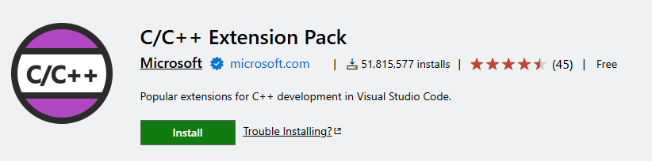

# In-code documentation

## Goals!

- Learn how to write good in-code documentation
- Learn how to use Doxygen
- Create and deploy documentation for an example project

::: {.notes}
I'll give you my opinions, searching for information on any of these topics
online will yield any number of other opinions that you can consult!
:::

## "Good code documents itself"
::: {.r-stack}
::: {.fragment .fade-out fragment-index=1}
$$
\epsilon = \sqrt{\sum_i^n \frac{{\left(\hat{x}_{i} - x_{i}\right)}^2}{n}}
$$
:::

::: {.fragment .fade-in-then-out fragment-index=1}

::: {.panel-tabset}

## C

```c

```

## Python

```python

```

:::
:::

::: {.fragment .fade-in-then-out fragment-index=3}
::: {style="font-size: 80%"}

::: {.panel-tabset}

## C

```c

```

## Python

```python

```

:::
:::
:::
:::

::: {.notes}
This is a common and imo often misunderstood phrase.

Good code has comments where they are useful and has sensible naming to reduce the need for this where possible.
:::

## Comments

::: {.r-stack}
::: {.fragment .fade-out fragment-index=1}
::: {style="font-size: 60%"} 
::: {.panel-tabset}

## C

```{.c code-line-numbers="9-15"}

```

## Python

```{.python code-line-numbers="13-17"}

```

:::
:::

Comments should enhance understanding - explain blocks,
describe confusing lines, justify workarounds, etc.

:::
::: {.fragment fragment-index=1}

:::
:::

## Docstrings

::: {style="font-size: 60%"}

::: {.panel-tabset}

## C

```{.c code-line-numbers="1-6"}

```

## Python

```{.python code-line-numbers="2-12"}

```

:::
:::
Docstrings give a structured way to define your interfaces
(and can be used to auto generate full reference docs!)

## Doxygen


<https://www.doxygen.nl/>

## Exercise 1

1. Install Doxygen using Pixi:
   ```bash
   pixi init
   pixi add doxygen
   ```
2. Fork <https://github.com/AndrewLister-STFC/CCP-TEPP-SS-Docs>
3. Clone and open a terminal
4. Run ``doxygen``
5. Generate a blank config: ``doxygen -g``
6. Run ``doxygen`` again

## Doxyfile

All of the options for Doxygen are listed in the config file (``Doxyfile``) ready to be tuned to your tastes.

Some key options to change:

- ``PROJECT_NAME = "My Awesome C Project"``
- ``RECURSIVE = YES`` or ``INPUT = src include``
- ``EXTRACT_ALL = YES``

Still pretty empty...

## Filling in the docs!

::: {style="font-size: 80%"}
- Documentation is specified using ``///`` (you may see other variants too)
- Special commands tell doxygen what is being documented:
  - ``@file`` - Required to document a file (when not using ``EXTRACT_ALL``)
  - ``@brief ...`` - A short description
  - ``@param <var> ...`` - For describing method parameters
  - ``@return ...`` - For describing method return values
- For C/C++, generally put the docs in the header file
:::

Try to explain the purpose of variables or provide context rather than restating the type.

## Example

```c
/// @file
/// A simulator for particle collisions in a beamline

/// Check for a collision between two particles in the next step
/// @param p1 The first patricle to check
/// @param p2 The second patricle to check
/// @param step Length of the time step
/// @return Whether there is a collision in the timeframe
bool is_collision(particle* p1, particle* p2, double step);
```

## Exercise 2

1. Add a description for the file at the top of the header (using ```/// @file```)
2. ``EXTRACT_ALL = NO``
3. Run ``doxygen``
4. Fix the warnings by adding docs where needed
5. Commit the changes

## In the wild

Have a look at:

- [LAPACK docs](https://www.netlib.org/lapack/explore-html/) and [LAPACK docs source](https://github.com/Reference-LAPACK/lapack/blob/master/DOCS)
- [libstdc++](https://gcc.gnu.org/onlinedocs/libstdc++/latest-doxygen/index.html)
- [Coin3D](https://www.coin3d.org/coin/index.html) (to prove it can look nice)
- Any of the other projects listed on <https://www.doxygen.nl/examples.html>

What other features can you find in the docs?

## Getting Fancy

Pages can be added with [markdown](https://www.doxygen.nl/manual/markdown.html#markdown_dox).
Use the ``{#mainpage}`` tag to update the front page of your docs

```md
My Main Page {#mainpage}
============

Welcome to the docs, have a look around
```

## Getting Fancy

Groups can be used to impose structure on the docs

- ``@defgroup``, ``@{``, ``@}`` to define groups
- ``@ingroup`` to populate groups

e.g. [LAPACK](https://github.com/Reference-LAPACK/lapack/blob/master/DOCS/groups-usr.dox)

## Hosting on GitHub pages

Docs are only useful if people can find them!

Github offer free webhosting on public repos


## Hosting on GitHub pages

- Settings -> Pages -> Source: GitHub Actions
- Move ``action.yaml`` to a ``.github/workflows`` directory
- Commit and push

## Bonus content: VSCode extension


- Auto generate docstring boilerplate
- Show docs on hover

## Final message

:x: Duplicate information in comments

:x: Write API docs manually

:heavy_check_mark: Write comments that explain code

:heavy_check_mark: Use tools like Doxygen to generate documentation

:heavy_check_mark: Publish the docs online
