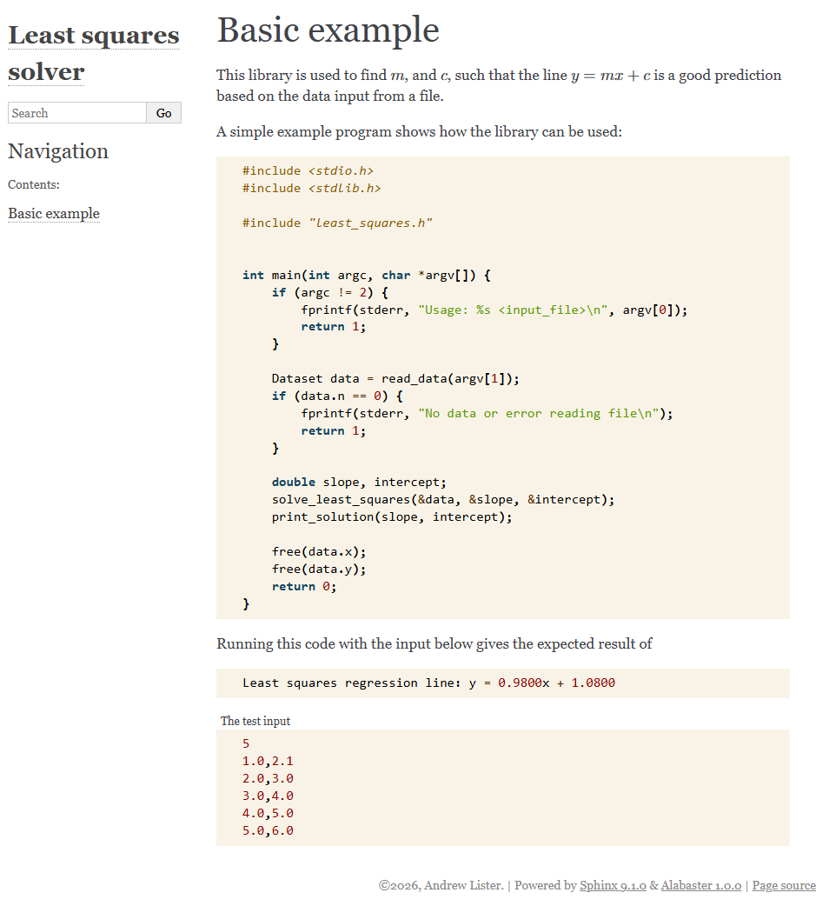

# Out-of-code Documentation

## Goals!

- Learn about the variety of documentation
- Learn how to use Sphinx
- Write and publish documentation using Sphinx and ReadTheDocs

(Both Sphinx and Doxygen can do in-code and out-of-code)

## Why not just use the API?

Motivating example:

- How do I install [Grid](https://github.com/paboyle/Grid)?

What other docs might we want?

## Other kinds of documentation

::: {style="font-size: 80%"}

- Overview/README
- Reference
- Install/Set up instructions
- Examples
- Tutorials
- Methods used
- Contributor guidelines
- Style guide
- Github/gitlab pull request checklists
- Git history (issues, pull requests, and commits)
- Discussion boards
- ...

:::

## Sphinx {.nostretch}

{width=30%}

<https://www.sphinx-doc.org/en/master/>

- [Python docs](https://docs.python.org/3/)
- [Linux docs](https://docs.kernel.org/)

## Excercise 1

1. ``pixi add sphinx``
2. Make a new directory for the docs
3. Generate a config file using ``sphinx-quickstart``
4. Build the new docs ``make html``

## Writing Sphinx docs

Can use ``.rst`` or ``.md`` files.

::: {.columns}
::: {.column}
### ReStructuredText

:x: Another format to learn

:heavy_check_mark: Only need Sphinx

:heavy_check_mark: Sphinx docs give examples in rst
:::
::: {.column}
### MarkDown

:heavy_check_mark: More common format

:x: Requires the MyST MarkDown extension to work

:heavy_check_mark: Easier to read the source (?)
:::
:::
We'll use markdown!

## Writing Sphinx docs

- ``pixi add myst-parser``
- The configuration file
- The TOC tree
- Directives and roles
- Including source code

## Excercise 2

::: {.columns}
::: {.column}
1. Add a "Basic example" page
2. Use the [MyST docs](https://myst-parser.readthedocs.io/en/latest/index.html) to add math and include source code
:::
::: {.column}

:::
:::

## Hosting on ReadTheDocs

We could build and host these via GitHub pages again but ReadTheDocs offers a better experience when using Sphinx

e.g. <https://docs.readthedocs.com/platform/stable/index.html>

## Hosting on ReadTheDocs

<https://docs.readthedocs.com/platform/stable/tutorial/index.html>

1. Login/SetUp an account: <https://app.readthedocs.org/>
2. Add a [``.readthedocs.yaml`` file](https://docs.readthedocs.com/platform/stable/config-file/index.html) to our repo
3. Add a project: <https://app.readthedocs.org/dashboard/import/>
4. Check the docs!

## Bonus content: Branches on ReadTheDocs

Docs can be set up so that pull requests build the docs which can then be reviewed before merging!

Each release will be tagged on ReadTheDocs to let users find the info for the version they have installed!

Docs link back to your repo so users can find the code easily!

## Final message

:x: Assume the user will make do with API docs

:heavy_check_mark: Make it easy to get started and understand why to use your software

:heavy_check_mark: Sphinx and ReadTheDocs are great choices for general docs

:heavy_check_mark: Publish the docs online!
